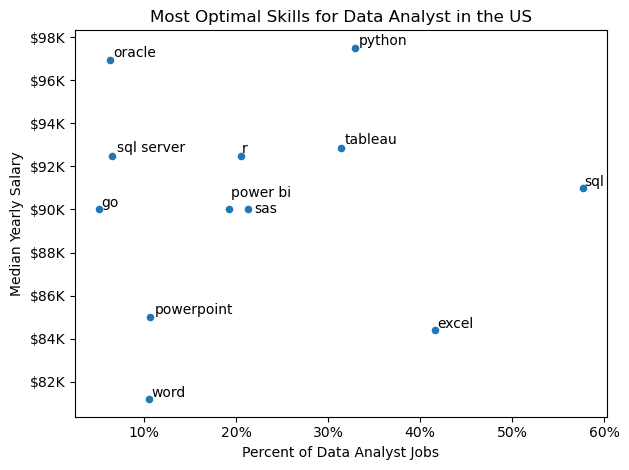

# Overview

Welcome to my analysis of the data job market, focusing on data analyst roles. This project was created out of a desire to navigate and understand the job market more effectively. It delves into the top-paying and in-demand skills to help find optimal job opportunities for data analysts.

The data sourced from Luke Barousse's Python Course which provides a foundation for my analysis, containing detailed information on job titles, salaries, locations, and essential skills. Through a series of Python scripts, I explore key questions such as the most demanded skills, salary trends, and the intersection of demand and salary in data analytics.

# The Questions  

Below are the questions I want to answer in my project:  

1. What are the skills most in demand for the top 3 most popular data roles?  
2. How are in-demand skills trending for Data Analysts?  
3. How well do jobs and skills pay for Data Analysts?  
4. What are the optimal skills for data analysts to learn? (High Demand AND High Paying)  


# Tools I Used  

For my deep dive into the data analyst job market, I harnessed the power of several key tools:  

- **Python:** The backbone of my analysis, allowing me to analyze the data and find critical insights. I also used the following Python libraries:  
  - **Pandas Library:** This was used to analyze the data.  
  - **Matplotlib Library:** I visualized the data.  
  - **Seaborn Library:** Helped me create more advanced visuals.  

- **Jupyter Notebooks:** The tool I used to run my Python scripts which let me easily include my notes and analysis.  

- **Visual Studio Code:** My go-to for executing my Python scripts.  

- **Git & GitHub:** Essential for version control and sharing my Python code and analysis, ensuring collaboration and project tracking.  


# The Analysis
Each Jupyter notebook for this project aimed at investigating specific aspects of the data job market. Here's how I approached each question:

## 1. What are the most demanded skills for the top 3 most popular data roles?

To find the most demanded skills for the top 3 most popular data roles. I filtered out those positions by which ones were the most popular, and got the top 5 skills for these top 3 roles. This query highlights the most popular job titles and their top skills, showing which skills I should pay attention to depending on the role I'm targeting.

View my notebook with detailed steps here: [2_Skill_Demand.ipynb](3_Project/2_Skill_Demand.ipynb)

### Visualize Data 
``` python
fig, ax = plt.subplots(len(job_titles), 1)

sns.set_style('ticks')

for i, title in enumerate(job_titles):
    df_plot = df_skills_perc[df_skills_perc['job_title_short'] == title].head(5)
    sns.barplot(data=df_plot, x = 'skill_percent', y = 'job_skills', ax=ax[i], hue = 'skill_count', palette='dark:b_r')

plt.show()
```

### Results


### Insights
- Python is a versatile skill, highly demanded across all three roles, but most prominently for Data Scientists (72%) and Data Engineers (65%).
- SQL is the most requested skill for Data Analysts and Data Scientists, with it in over half the job postings for both roles. For Data Engineers, Python is the most sought-after skill, appearing in 68% of job postings.
- Data Engineers require more specialized technical skills (AWS, Azure, Spark) compared to Data Analysts and Data Scientists who are expected to be proficient in more general data management and analysis tools (Excel, Tableau).

## 2. How are in-demand skills trending for Data Analysts?

### Visualize Data

```python
from matplotlib.ticker import PercentFormatter

df_plot = df_DA_US_percent.iloc[:, :5]
sns.lineplot(data= df_plot, dashes=False, palette='tab10')
ax = plt.gca()
ax.yaxis.set_major_formatter(PercentFormatter(decimals=0))
plt.show()
```

### Results
  
*Bar graph visualizing the trending top skills for data analysts in the US in 2023.*

### Insights:
- SQL remains the most consistently demanded skill throughout the year, although it shows a gradual decrease in demand.  
- Excel experienced a significant increase in demand starting around September, surpassing both Python and Tableau by the end of the year.  
- Both Python and Tableau show relatively stable demand throughout the year with some fluctuations but remain essential skills for data analysts.  
- Power BI, while less demanded compared to the others, shows a slight upward trend towards the year's end.


## 3. How well do jobs and skills pay for Data Analysts?

### Salary Analysis for Data Nerds

#### Visualize Data

```python
sns.boxplot(data=df_US_top6, x='salary_year_avg',
            y='job_title_short', order=job_order)

ticks_x = plt.FuncFormatter(lambda y, pos: f'${int(y/1000)}K')
plt.gca().xaxis.set_major_formatter(ticks_x)
plt.show()

```

#### Results  

  

*Box plot visualizing the salary distributions for the top 6 data job titles.*

#### Insights  

- There's a significant variation in salary ranges across different job titles. Senior Data Scientist positions tend to have the highest salary potential, with up to $600K, indicating the high value placed on advanced data skills and experience in the industry.  

- Senior Data Engineer and Senior Data Scientist roles show a considerable number of outliers on the higher end of the salary spectrum, suggesting that exceptional skills or circumstances can lead to high pay in these roles. In contrast, Data Analyst roles demonstrate more consistency in salary, with fewer outliers.  

- The median salaries increase with the seniority and specialization of the roles. Senior roles (Senior Data Scientist, Senior Data Engineer) not only have higher median salaries but also larger differences in typical salaries, reflecting greater variance in compensation as responsibilities increase.

### Highest Paid & Most Demanded Skills for Data Analysts

```python
fig, ax = plt.subplots(2, 1, sharex=True)
sns.barplot(data=high_paid_skills, y='job_skills', x='salary_year_avg', palette='viridis', ax=ax[0])
sns.barplot(data=in_demand_skills, y='job_skills', x='median', palette='viridis', ax=ax[1])

plt.show()
```

### Results
Here's the breakdown of the highest-paid and most in-demand skills for data analysts in the US:


*Two separate bar graphs visualizing the highest paid skills and most in-demand skills for data analysts in the US.*

## 4. What is the most optimal skill to learn for Data Analysts?

#### Visualize Data

```python
from adjustText import adjust_text
import matplotlib.pyplot as plt

plt.scatter(df_DA_skills_high_demand
['skill_percent'], df_DA_skills_high_demand
['median_salary'])
plt.show()
```


*A scatter plot visualizing the most optimal skills (high paying & high demand) for data analysts in the US.*

## Insights
- The scatter plot shows that most of the `programming` skills tend to cluster at higher salary levels compared to other categories, indicating that programming expertise might offer greater salary benefits within the data analytics field.

- Analyst tools, including Tableau and Power BI, are prevalent in job postings and offer competitive salaries, showing that visualization and data analysis software are crucial for current data roles. This category not only has good salaries but is also versatile across different types of data tasks. 

- The database skills, such as Oracle and SQL Server, are associated with some of the highest salaries among data analyst tools. This indicates a significant demand and valuation for data management and manipulation expertise in the industry.

# What I Learned  

Throughout this project, I deepened my understanding of the data analyst job market and enhanced my technical skills in Python, especially in data manipulation and visualization. Here are a few specific things I learned:  

- **Advanced Python Usage:** Utilizing libraries such as Pandas for data manipulation, Seaborn and Matplotlib for data visualization, and other libraries helped me perform complex data analysis tasks more efficiently.  
- **Data Cleaning Importance:** I learned that thorough data cleaning and preparation are crucial before any analysis can be conducted, ensuring the accuracy of insights derived from the data.  
- **Strategic Skill Analysis:** The project emphasized the importance of aligning one's skills with market demand. Understanding the relationship between skill demand, salary, and job availability allows for more strategic career planning in the tech industry.  

# Insights  

This project provided several general insights into the data job market for analysts:  

- **Skill Demand and Salary Correlation:** There is a clear correlation between the demand for specific skills and the salaries these skills command. Advanced and specialized skills like Python and Oracle often lead to higher salaries.  
- **Market Trends:** There are changing trends in skill demand, highlighting the dynamic nature of the data job market. Keeping up with these trends is essential for career growth in data analytics.  
- **Economic Value of Skills:** Understanding which skills are both in-demand and well-compensated can guide data analysts in prioritizing learning to maximize their economic returns.  

# Challenges I Faced  

This project was not without its challenges, but it provided good learning opportunities:  

- **Data Inconsistencies:** Handling missing or inconsistent data entries requires careful consideration and thorough techniques to ensure the integrity of the analysis.  
- **Complex Data Visualization:** Designing effective visual representations of complex datasets was challenging, as it required conveying insights clearly and compellingly.  
- **Balancing Breadth and Depth:** Deciding how deeply to dive into each analysis while maintaining a broad overview of the data landscape required constant balancing to ensure comprehensive coverage without getting lost in details.  

# Conclusion  

This exploration into the data analyst job market has been incredibly informative, highlighting the critical skills and trends that shape this evolving field. The insights I got enhance my understanding and provide actionable guidance for anyone looking to advance their career in data analytics. As the mar
